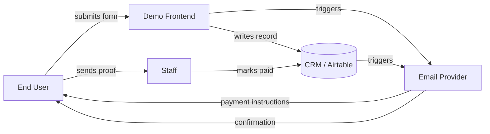
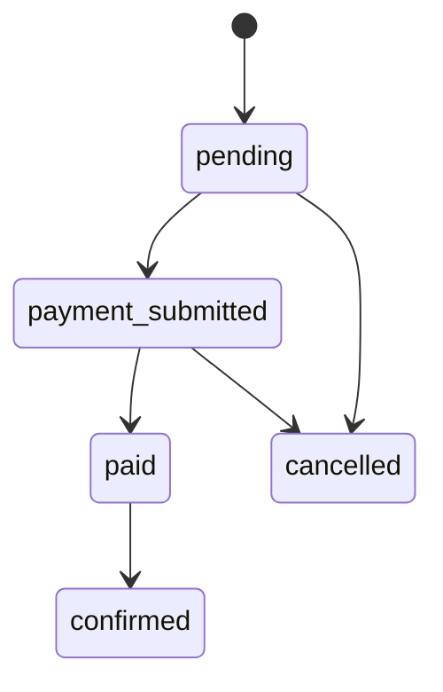

# [Client Name] — Functional Specification (SPEC)

> SPEC = functional specification for the Phase-2 handoff. Unrelated to Feature-Sliced
> Design (FSD), which this repo's lint enforces.
>
> Copy to `demos/<slug>/SPEC.md` at **handoff only**. This is not written during the demo
> build — the demo ships on placeholder copy and no backend, so there is nothing yet for an
> SPEC to specify. It gets filled in when a demo is confirmed and handed to the team that
> builds the real backend (forms, CRM, emails, payments) for Phase 2.
>
> Fill it in from three sources: the shipped code (`apps/web/src/pages/*/ui/*-section.tsx`, `apps/web/src/pages/*/config/*.content.ts`, any forms),
> `PRD.md` (the story, stats, copy), and `README.md` (stack, scripts). Every value should be
> traceable to one of those three — don't invent behavior the demo doesn't actually have.
>
> Every field is either a **concrete value** or the literal word `ASK` — never a vibe.
> "Staff review it" is not a value. "Staff mark `paid` in Airtable within 1 business day,
> triggering the confirmation email" is.

---

## 0. Document info

| Field   | Value                               |
| ------- | ----------------------------------- |
| Version | [1.0]                               |
| Date    | [YYYY-MM-DD]                        |
| Owner   | [who wrote this — Chan / team lead] |
| Status  | [draft / in review / approved]      |

**PM:** everything to run by the client is in §11 Open decisions (Owner = Client).

**How to read this doc:** §1–3 set scope and shared vocabulary — read those first regardless
of role. §4 (Functional flows) is the spec proper — one block per user-facing flow, each
self-contained. §5–8 are reference material the flows point back into. §9–13 are what a
backend engineer needs before writing code that touches money, personal data, or email
deliverability. The **pre-handoff checklist** at the end is the definition of done for this
document, not for the build.

---

## 1. Purpose & scope

**Purpose:** [one sentence — e.g. "Specify the backend behavior needed to take the Adrian
Ding demo from static copy to a working workshop-registration funnel."]

**In scope:**

- [e.g. Workshop registration form → payment instructions → manual payment verification → confirmation]
- [e.g. Admin marking registrations paid in the CRM]

**Out of scope:** [→ full list goes in §12, but name the big ones here so scope is obvious
at a glance — e.g. "Automated payment gateway (manual bank transfer only for v1)"]

---

## 2. System overview

**Actors:**

| Actor                   | Role                                        |
| ----------------------- | ------------------------------------------- |
| [End user / registrant] | [fills the form, pays, attends]             |
| [Staff / admin]         | [reviews payment proof, marks paid in CRM]  |
| [System]                | [sends transactional email, updates status] |

**Systems involved:** [e.g. TanStack Start frontend, Airtable/CRM, email provider (Resend/Postmark),
payment: manual bank transfer + proof upload]

Phase-2 backend lands **in this same monorepo**: TanStack Start server functions
(`.agents/data-flow.md`), opt-in `@zo-stack/db` (`.agents/database.md`) and `@zo-stack/auth`
(`.agents/auth.md`), and env through `packages/env` (`.agents/environment-variables.md`).

**Context diagram** (fill in the stub — boxes are actors/systems, arrows are the data or
email that crosses the boundary):

---

## 3. Conventions

Fix these once so every flow below can reuse them without re-explaining.

| Convention                    | Value                                                                       |
| ----------------------------- | --------------------------------------------------------------------------- |
| Reference ID format           | [e.g. `WS-2026-0001` — prefix + year + zero-padded sequence]                |
| Status names (canonical list) | [e.g. `pending` → `payment_submitted` → `paid` → `confirmed` → `cancelled`] |
| Timezone                      | [e.g. Asia/Manila, UTC+8 — state it; don't leave server default implicit]   |
| Currency                      | [e.g. PHP, ₱, 2 decimal places]                                             |
| Email sender                  | [e.g. `hello@client.com`]                                                   |
| Email reply-to                | [e.g. `support@client.com` — may differ from sender]                        |

---

## 4. Functional flows

> One block per flow. Copy the block below for each additional flow. Keep flows small and
> named after the user action that starts them ("Workshop registration", not "Registration
> system").

### 4.0 Flow template (copy this block)

**Flow name:** [name]
**Trigger:** [what starts this — e.g. "user submits the registration form on `/workshop`"]
**Actors:** [who's involved]
**Preconditions:** [what must be true first — e.g. "workshop has open seats"]

**Steps:**

| #   | Actor | Action | System response | Data written | Email sent |
| --- | ----- | ------ | --------------- | ------------ | ---------- |
| 1   |       |        |                 |              |            |
| 2   |       |        |                 |              |            |

**Status transitions:** [e.g. `pending` → `payment_submitted`]

**Edge cases & errors:** [e.g. "duplicate submission with same email — dedupe on email+workshop
ID"; "seats sell out mid-submission"; "payment proof file too large"]

**Acceptance criteria (Given/When/Then):**

- Given [state], when [action], then [outcome].

**Demo today vs. to build:**

| Aspect                 | Demo today                             | To build                                          |
| ---------------------- | -------------------------------------- | ------------------------------------------------- |
| [e.g. form submission] | [e.g. logs to console, no persistence] | [e.g. writes to CRM table, validates server-side] |

---

### 4.1 Worked example — Workshop registration → payment → confirmation

**Flow name:** Workshop registration and payment confirmation
**Trigger:** User submits the registration form on the workshop page.
**Actors:** End user (registrant), Staff, System (email + CRM)
**Preconditions:** The workshop is published and has open seats.

**Steps:**

| #   | Actor  | Action                                                                  | System response                                                           | Data written                                                     | Email sent                       |
| --- | ------ | ----------------------------------------------------------------------- | ------------------------------------------------------------------------- | ---------------------------------------------------------------- | -------------------------------- |
| 1   | User   | Fills and submits registration form (name, email, phone, workshop date) | Validates fields, generates reference ID, decrements available seats      | New registration record, status `pending`                        | —                                |
| 2   | System | —                                                                       | Sends payment instructions (bank details, amount, reference ID, deadline) | —                                                                | **Payment Instructions** email   |
| 3   | User   | Sends payment and uploads/emails proof of payment                       | Staff notified of new submission                                          | Registration updated with proof link, status `payment_submitted` | —                                |
| 4   | Staff  | Reviews proof in CRM, marks registration `paid`                         | System detects status change                                              | Status field updated to `paid`, `paid_at` timestamp set          | —                                |
| 5   | System | —                                                                       | On status → `paid`, auto-sends confirmation                               | Status set to `confirmed`                                        | **Registration Confirmed** email |

**Status transitions:** `pending` → `payment_submitted` → `paid` → `confirmed` (with `cancelled`
reachable from `pending` or `payment_submitted` if the deadline lapses — see §6).

**Edge cases & errors:**

- Duplicate submission with the same email for the same workshop date — reject with a
  message pointing to the existing reference ID, don't create a second record.
- Payment deadline lapses with no proof — auto-cancel and release the seat (see §6).
- Proof upload fails or is illegible — staff can request re-submission without cancelling.
- Workshop sells out between page load and submit — show a sold-out message, no record written.

**Acceptance criteria (Given/When/Then):**

- Given open seats, when a user submits a valid form, then a `pending` registration is
  created and the payment instructions email is sent within [1 minute].
- Given a `pending` registration past its deadline with no proof, when the deadline job runs,
  then the registration moves to `cancelled` and the seat is released.
- Given a `payment_submitted` registration, when staff mark it `paid`, then the confirmation
  email sends automatically without a second manual step.

**Demo today vs. to build:**

| Aspect          | Demo today                                                   | To build                                                      |
| --------------- | ------------------------------------------------------------ | ------------------------------------------------------------- |
| Form submission | Client-side only, no persistence, no validation beyond HTML5 | Server-side validation, writes to CRM, generates reference ID |
| Payment         | No instructions, no proof upload                             | Payment instructions email, proof upload/email intake         |
| Status tracking | None — demo has no concept of registration state             | Full status machine in CRM (§6)                               |
| Confirmation    | None                                                         | Triggered email on staff action                               |

---

## 5. Data model

> One table per entity that gets persisted. List fields, types, and which flow writes them —
> don't design the full schema here, just what the flows above require.

**[Entity name, e.g. Registration]**

| Field          | Type                | Notes               |
| -------------- | ------------------- | ------------------- |
| `id`           | [uuid / autonumber] | primary key         |
| `reference_id` | string              | format from §3      |
| `status`       | enum                | values from §3 / §6 |
|                |                     |                     |

---

## 6. State machines

> One per entity with a lifecycle (usually the same entities as §5). Draw the stub, then fill
> the transition table with exactly what triggers each arrow — a flow step should point back
> here, and every arrow here should trace to a flow step.

| From                            | To                  | Trigger           | Who / what causes it   |
| ------------------------------- | ------------------- | ----------------- | ---------------------- |
| —                               | `pending`           | form submitted    | User (§4.1 step 1)     |
| `pending`                       | `payment_submitted` | proof received    | User (§4.1 step 3)     |
| `payment_submitted`             | `paid`              | staff review      | Staff (§4.1 step 4)    |
| `paid`                          | `confirmed`         | confirmation sent | System (§4.1 step 5)   |
| `pending` / `payment_submitted` | `cancelled`         | deadline lapsed   | System (scheduled job) |

---

## 7. Email catalogue

> Every transactional email the flows above send. Each row must trace back to a step in §4.

| Email                  | Trigger                            | Sender / reply-to | Recipient  | Key variables                                |
| ---------------------- | ---------------------------------- | ----------------- | ---------- | -------------------------------------------- |
| Payment Instructions   | Registration created (§4.1 step 2) | [from §3]         | Registrant | reference ID, amount, deadline, bank details |
| Registration Confirmed | Status → `paid` (§4.1 step 5)      | [from §3]         | Registrant | reference ID, workshop date/time, location   |
| [Cancellation notice]  | Status → `cancelled`               |                   | Registrant |                                              |

**Template polish (list what each demo's email previews still need before they send).** Demo email previews are built with web components, so they almost always need:

- **Header sizing:** fixed pixel width/height for a 600px layout, so nothing jumps while images load and it still reads with images blocked (alt text, background colour).
- **Image loading:** absolute hosted URLs, 2×, compressed. No framework image components, lazy loading or CSS-background images.
- **Fonts:** brand web fonts only load in some clients (Apple Mail, iOS). Set a close fallback stack (serif → Georgia, sans → Helvetica/Arial) for Gmail and Outlook.
- **Checks:** mobile spacing and tap targets, dark mode, a plain-text version, and a test send to Gmail, Apple Mail and Outlook.

---

## 8. Admin / CMS functions

> What staff can do that isn't a customer-facing flow — the CRM/CMS side of §4.

| Function                | Who            | Description                                        |
| ----------------------- | -------------- | -------------------------------------------------- |
| Mark registration paid  | Staff          | Reviews proof, flips status — triggers §4.1 step 5 |
| View registration list  | Staff          | Filter by status, workshop date                    |
| [Edit workshop details] | [Chan / staff] |                                                    |

---

## 9. Non-functional requirements

**Privacy & consent:**

- [ ] Data collected is limited to what each flow in §4 actually needs.
- [ ] Consent language present on any form collecting personal data (name, email, phone).
- [ ] Philippine Data Privacy Act (RA 10173) — registrant data has a stated retention period,
      a way to request deletion, and is not shared with third parties beyond what's declared.
- [ ] [Any cross-border data transfer — e.g. email provider hosted outside PH — disclosed.]

**Spam protection:** [e.g. honeypot field + rate limit per IP on the registration form]

**Deliverability:** [e.g. SPF/DKIM/DMARC configured for the sending domain; sender domain
warmed up before go-live; bounces/complaints monitored]

**Accessibility:** [form fields labeled, errors announced, keyboard-operable — inherits the
demo's existing a11y baseline; note anything new the backend introduces, e.g. file upload]

**Field purposes (PM confirms with the client).** RA 10173 needs a declared purpose for every field collected, listed in the privacy notice and covered by the consent text. Fill one row per form field:

| Form           | Field         | Purpose                              | For the PM to confirm with the client       |
| -------------- | ------------- | ------------------------------------ | ------------------------------------------- |
| [Registration] | [salaryRange] | [Audience analytics, aggregate only] | [Consent text covers analytics? Retention?] |

Anything beyond handling the submission (analytics, marketing emails) needs the consent text extended, and marketing needs a separate unticked opt-in.

---

## 10. Integrations & environment variables

Env vars are declared and validated through `packages/env` (`.agents/environment-variables.md`); server logic goes in TanStack Start server functions (`.agents/data-flow.md`).

| Integration           | Purpose                          | Env var(s)                             | Owner  |
| --------------------- | -------------------------------- | -------------------------------------- | ------ |
| [CRM — e.g. Airtable] | Registration storage             | `AIRTABLE_API_KEY`, `AIRTABLE_BASE_ID` | [team] |
| [Email — e.g. Resend] | Transactional email              | `RESEND_API_KEY`                       | [team] |
| [Payment]             | [manual for v1 — no integration] | —                                      | —      |

---

## 11. Decisions log & open decisions

**Decisions made:**

| Date   | Decision                                                    | Made by                |
| ------ | ----------------------------------------------------------- | ---------------------- |
| [date] | [e.g. "Payment is manual bank transfer for v1, no gateway"] | [client / Chan / team] |

**Open decisions (need an owner before build starts):**

> **This is the PM's list.** Every question for the client anywhere in this doc (field purposes, policies like the seat hold, contradictions found) gets a row here with Owner = Client, so the PM never has to hunt through other sections. Answers move to the decisions log with a date.

| Question                                                      | Owner                  |
| ------------------------------------------------------------- | ---------------------- |
| [e.g. "How long is the payment deadline before auto-cancel?"] | [client / Chan / team] |

---

## 12. Out of scope / future

- [e.g. Automated payment gateway integration — v2]
- [e.g. Waitlist when a workshop sells out]
- [e.g. Multi-language emails]

---

## 13. Traceability

> Map every form, email, and page in the flows above to the file that renders it in the
> shipped demo — this is what lets the backend team find the exact hook point.

| Item                       | Type                | File path                                         |
| -------------------------- | ------------------- | ------------------------------------------------- |
| Registration form          | Form                | `apps/web/src/pages/[page]/ui/[file]-section.tsx` |
| Payment Instructions email | Email (copy source) | [PRD.md §Content, or new]                         |
| Workshop page              | Page                | `apps/web/src/routes/[route].tsx`                 |

---

## Pre-handoff checklist

- [ ] Every form in the demo has a corresponding flow in §4.
- [ ] Every email in the catalogue (§7) has a trigger that traces to a flow step in §4.
- [ ] Every status in §6 has both an incoming and an outgoing transition (no dead-end or
      unreachable states).
- [ ] Every open decision in §11 has a named owner (client / Chan / team) — none left blank.
- [ ] Every row in §13 (Traceability) points to a real file path in the shipped repo.
